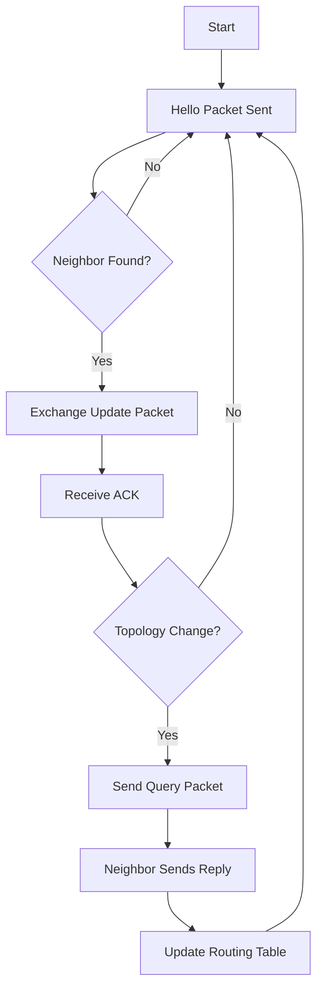

<a name="top"></a>

[]()
[]()
[]()
[]()
[]()
[]()
[](#-license)

⭐ Star us on GitHub — it motivates us a lot!

[](https://github.com/AOB-Creator/CCNA-road)
[](https://github.com/AOB-Creator/CCNA-road)
[](https://github.com/AOB-Creator/CCNA-road)
[](https://github.com/AOB-Creator/CCNA-road)
[](https://github.com/AOB-Creator/CCNA-road)

## 🛰️ Enhanced Interior Gateway Routing Protocol (EIGRP)

## 📖 Overview
**EIGRP** is a Cisco-proprietary **hybrid routing protocol** (combines features of distance-vector and link-state) used to efficiently route IP packets within an autonomous system (AS). It’s designed for **fast convergence, scalability, and low bandwidth usage**.

Introduced by Cisco in 1992, EIGRP uses the **Diffusing Update Algorithm (DUAL)** to ensure loop-free paths and rapid recovery from network topology changes.

---

## 🔑 Key Features
- **Protocol Type:** Advanced Distance Vector (Hybrid)
- **Administrative Distance:**
  - **Internal routes:** 90
  - **External routes:** 170
- **Metric Calculation:** Composite metric using **Bandwidth, Delay, Reliability, Load, and MTU** (default uses only Bandwidth & Delay)
- **Convergence:** Fast (DUAL ensures loop-free & backup routes)
- **Transport:** Uses **RTP (Reliable Transport Protocol)** for guaranteed delivery of updates
- **Routing Updates:** Incremental (partial) updates only to affected neighbors
- **Classless Protocol:** Supports VLSM and CIDR
- **Authentication:** Supports MD5 and SHA authentication
- **Load Balancing:** Equal & Unequal cost (via `variance` command)
- **Support for Multiple Protocols:** IPv4, IPv6, AppleTalk, IPX (legacy)

---

## ⚙️ EIGRP Packet Types
EIGRP uses five packet types:

| Packet Type | Purpose |
|-------------|---------|
| **Hello**   | Discover & maintain neighbor relationships |
| **Update**  | Route changes sent reliably to neighbors |
| **Query**   | Request information when no feasible successor exists |
| **Reply**   | Response to a Query packet |
| **ACK**     | Acknowledgement for Update, Query, and Reply packets |

---

## 🧮 EIGRP Metric Formula
```bash
Metric = [ (10^7 / Minimum Bandwidth) + (Sum of Delays / 10) ] * 256
```

- **Bandwidth** = Minimum bandwidth (kbps) along the path
- **Delay** = Cumulative delay (microseconds) along the path
- Reliability & Load can be included if explicitly configured

---

## 📡 Neighbor Relationships
- Formed by exchanging **Hello packets** on interfaces
- Default Hello & Hold Timers:
  - Hello: 5 seconds (Ethernet, point-to-point) / 60 seconds (low-speed links)
  - Hold: 15 seconds / 180 seconds (low-speed links)
- Must match: **K-values**, AS number, subnet, authentication

---

## 🛠️ Basic Configuration
```cisco
# Enable EIGRP
router eigrp 100
 network 192.168.1.0 0.0.0.255
 no auto-summary

# Optional tuning
eigrp log-neighbor-changes

```

## 📋 Important Show Commands

```shell
show ip eigrp neighbors     # View neighbor relationships
show ip eigrp topology      # View feasible successors & routes
show ip route eigrp         # View EIGRP-learned routes
```

## 🔄 EIGRP Terminology

EIGRP uses several key terms to describe its routing process:

| Term | Definition | Example |
|------|------------|---------|
| **Successor** | The best (primary) route to reach a destination, stored in the routing table. | If Router A can reach Network X via Router B with the lowest metric, Router B is the successor. |
| **Feasible Successor (FS)** | A backup route that meets the Feasibility Condition (RD < FD). Stored in the topology table, used immediately if the successor fails. | Router C has a backup link to Network X with RD lower than FD of the successor route. |
| **Feasible Distance (FD)** | The lowest total metric from the local router to the destination via the successor. | FD to Network X = 2560 |
| **Reported Distance (RD)** | The metric from a neighbor to the destination, as reported to the local router. | RD from Router B to Network X = 1500 |
| **Feasibility Condition (FC)** | Rule to determine if a neighbor’s route is loop-free: **RD < FD**. | If RD from Router C to Network X is 1200 and FD via successor is 2000 → FC met. |
| **DUAL (Diffusing Update Algorithm)** | The algorithm EIGRP uses to calculate loop-free paths and provide fast convergence. | DUAL maintains both successor and feasible successor routes. |
| **Topology Table** | A database of all learned routes, including successors and feasible successors, with their metrics. | `show ip eigrp topology` command displays this. |
| **Passive State** | Indicates a stable route with no ongoing recalculation. | `P` in topology output. |
| **Active State** | Indicates that DUAL is recalculating a route because the successor failed and no FS exists. Queries are sent to neighbors. | `A` in topology output. |
| **Stuck in Active (SIA)** | A condition when a router does not receive replies to its queries within the hold time, causing neighbor reset. | Common cause: Network congestion or misconfigured neighbors. |


## 📦 EIGRP Packet Flow




- **Email**: Send us your inquiries or support requests at [business.alpamis@gmail.com](mailto:business.alpamis@gmail.com).
- **Website**: Visit the official Abblix OIDC Server page for more information: [ADN-SPACE](https://alpamis-adn.vercel.app).

Subscribe to our LinkedIn and Twitter:

[](https://x.com/AlpamisOmirbek2?t=n_PyU3oFaGuzd31dFO2UfQ&s=09)

We look forward to assisting you and ensuring your experience with our products is successful and enjoyable!

[Back to top](#top)
